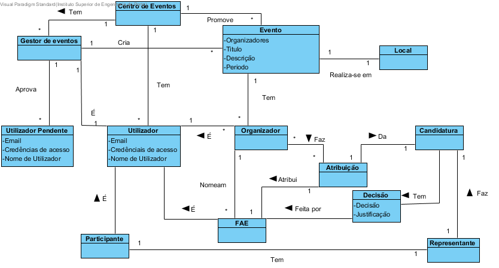

# Análise OO
## Tabela de Categorias
| Categoria                                                         | Conceito |
|-------------------------------------------------------------------|----------|
| Transações(do negócio)                                            |Candidatura, Decisão de candidatura|
| Linhas de transações                                              |     /    |
| Produtos ou serviços relacionados com transações                  |     /    |
| Registos (de transações)                                          |     /    |
| Papéis das pessoas                                                |Utilizador, Gestor de eventos, Organizadores, FAE, Representante do Participante|
| Lugares                                                           |Local,Centro de eventos|
| Eventos                                                           |Eventos   |
| Objetos físicos                                                   |     /    |
| Especificações e descrições                                       |     /    |
| Catálogos                                                         |     /    |
| Conjuntos (containers)                                            |Registo   |
| Elementos de conjuntos                                            |     /    |
| (Outras) Organizações                                             |Participantes|
| Outros sistemas (externos)                                        |     /    |
| Registos (financeiros), de trabalho, contratos, documentos legais |Registo de utilizadores|
| Intrumentos financeiros                                           |     /    |
| Documentos referidos/para executar as tarefas                     |     /    |

## Tabela de conceitos

| Conceito 1                                           | Associação    | Conceito 2         |
|------------------------------------------------------|---------------|--------------------|
| Gestor de eventos                                    | Cria          | Evento             |
|                                                      | Confirma      | Utilizador pendente|
|                                                      | É             | Utilizador         |
| Evento                                               | Tem           | Organizadores      |
|                                                      | Realiza-se num| Local              |
| Organizador                                          | Nomeam        | FAE                |
|                                                      | Recebe        | Candidatura        |
|                                                      | Distribui     | FAE                |
|                                                      | É             | Utilizador         |
| Representante                                        | Faz           | Candidatura        |
| Participante                                         | Tem           | Representante      |
|                                                      | É             | Utilizador         |
| FAE                                                  | Avalia        | Candidatura        |
|                                                      | É             | Utilizador         |
| Centro de eventos                                    | Tem           | Utilizador         |  

## Modelo de dominio

