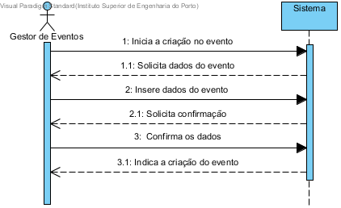

# UC1 Criar Evento
## Formato breve
O gestor de eventos inicia o sistema e intruduz no sistema os dados do evento nomeadamente o seu título, um texto descritivo do evento, o período de tempo e o local de realização e um conjunto de pessoas que estão responsaveis pela realização do evento(organizadores).

## SSD de Formato breve

## Formato completo

### Ator principal
* Gestor de eventos

### Partes interessadas e os seus interesses
+ Gestor de eventos: Pretende marcar um evento que será realizado no centro de eventos e encarregar organizadores de prepararem o espaço.
+ Centro de eventos: Pretende que seja marcado um evento que ser vai realizado no centro de eventos.
+ Organizadores: Pretendem que lhe sejam atribuido um evento para organizarem e prepararem o espaço.

### Pré-condições
+ Não existe um evento anteriormente marcado para o mesmo local no mesmo período de tempo.

### Pós-condições
* O evento fica marcado, no periodo de tempo e local estipulado, os organizadores ficam encarregues de preparar o evento.

### Cenário de sucesso principal (ou fluxo básico)
1. O gestor de eventos inicia o registo do evento.
2. O sistema solicita os dados do evento(titulo, descrição, periodo de realização, local de realização, organizadores encarregues).
3. O gestor de eventos introduz os dados solicitados.
4. O sistema valida os dados e solicita confirmação do gestor.
5. O gestor confirma os dados.
6. O sistema regista os dados e informa o gestor do sucesso da operação.

### Extensões (ou fluxos alternativos)
\*a. O gestor solicita o cancelamento do registo.

+ O caso de uso termina.

4a. O sistema detecta dados minimos obrigatórios em falta.
1. O sistema informa quais são os dados em falta.
2. O sistema permite a introdução dos dados em falta(passo 3).

  2.a O gestor não altera os dados. O caso de termina.

4b. O sistema detecta que os dados(ou algum subconjunto destes) intrudozidos devem ser únicos mas já existem no sistema.

1. O sistema avisa o gestor do facto.
2. O sistema permite a alteração dos dados(passo 3).
  2.a O gestor não altera os dados. O caso de uso termina.

4c. O sistema detecta que os dados(ou algum subconjunto destes) são inválidos.
1. O sistema avisa o gestor do facto.
2. O sistema permite a alteração dos dados(passo 3).
  2.a O utilizador não altera os dados. O caso de uso termina.

## Requisitos especiais
*

## Lista de variações em tecnologias e dados
*

## Frequência de ocorrência
*

## Questões em aberto
+ Quais são os dados obrigatórios para a criação do evento?
+ Podem existir eventos com o mesmo nome desde que a data e/ou o local sejam diferentes?
+ Como é que o gestor pode cancelar um evento?
+ Como são informados os organizadores que vão estar encarregues deste evento ?
+ Quão frequente é a criação de eventos?
