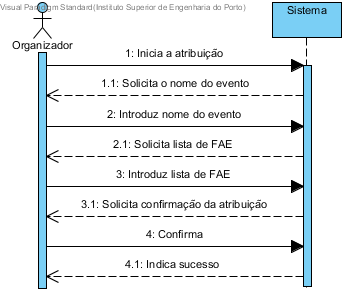

# UC2 Atribui FAE a evento
## Formato breve
O organizador inicia o sistema.
O sistema pede o nome do evento.
O organizador introduz nome.
O sistema pede lista de FAE.
O organizador introduz a lista de FAE.
O sistema pede confirmação.
O organizador confirma.
O sistema indica sucesso.
## SSD de formato breve

## Formato completo

### Ator principal
* Organizador

### Partes interessadas e seus interesses
+ Organizador: pertende defenir os funcionarios que estão encarregues do eveto.
+ FAE: é lhes dado um evento para coordenar
+ Centro de eventos: a equipa de funcionarios para um evento será criada.
### Pré-condições
+ A equipa para um determinado evento nao esta defenida
### Pós-condições
* A lista é guardada par o determinado evento e os FAE sao informados que estao encarreguesdo evento em questao

### Cenário de sucesso principal (ou fluxo básico)
1. O organizador inicia o sistema.
2. O sistema procura os eventos do organizador e mostra a lista de eventos.
3. O organizador seleciona o do evento.
4. O sistema pede a identificação do utilizador.
5. O organizador introduz o utilizador.  
6. O sistema valida o utilizador e adiciona-o como FAE do evento.  
7. Os passos 4 a 6 repetem-se até todos os FAE estarem introduzidos.
8. O sistema pede confirmação dos dados introduzidos.
9. O utilizador confirma os utilizadores introduzidos.
10. O sistema indica sucesso.

### Extensões (ou fluxos alternativos)

\*a O organizador solicita o cancelamento do processo

 + O caso de uso termina.

3a. Dados mínimos obrigatórios em falta.

1. O sistema informa quais os dados em falta.
2. O sistema permite a introdução dos dados em falta (passo 3)

    2.a O organizador não altera os dados. O caso de uso termina.

5a.  Dados mínimos obrigatórios em falta.

1. O sistema informa quais os dados em falta.
2. O sistema permite a introdução dos dados em falta (passo 3)

    2.a O organizador não altera os dados. O caso de uso termina.

5b. O sistema detecta que os dados introduzidos (ou algum subconjunto dos dados) são inválidos.

1. O sistema alerta o organizador para o facto.
2. O sistema permite a sua alteração (passo 3)

         2a. O organizador não altera os dados. O caso de uso termina.

## Requisitos especiais
**
## Listas de variações em tecnologias e dados
*
## Frequência de Ocorrência
*
## Questões em aberto
+ Quais são os dados dos FAE?
+ Quantos FAE devem estar encarregues de cada evento?
+ O organizador tem que fazer log in no sistema? se sim como são criadas contas / mudam password / são apagadas as contas?
+ Um organizador pode estar encarregue de multiplos eventos?
+ Se puder como é que o sistem deve perguntar a qual quer atribuir os FAE's?
+ Como é que se pode posteriormente alterar os FAE que estão destacados para um e vento?
