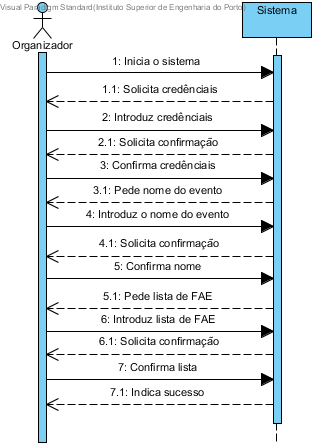

# UC2 Atribui FAE a evento
## Formato breve
O organizador inicia o sistema, insere as suas credenciais, diz qual é o evento a qual quer atribuir FAE, e quais são estes FAE.
## SDD de formato breve

## Formato completo

### Ator principal
* Organizador

### Partes interessadas e seus interesses
+ Organizador: pertende defenir os funcionarios que estão encarregues do eveto.
+ FAE: é lhes dado um evento para coordenar
+ Centro de eventos: a equipa de funcionarios para um evento será criada.
### Pré-condições
+ A equipa para um determinado evento nao esta defenida
### Pós-condições
* A lista é guardada par o determinado evento e os FAE sao informados que estao encarreguesdo evento em questao

### Cenário de sucesso principal (ou fluxo básico)
1. O organizador inicia o sistema.
2. O sistema pede o nome do evento.
3. O organizador introduz o nome do evento.
4. O sistema valida os dados e solicita confirmação
5. O organizador confirma o nome
6. O sistema pede a lista de FAE
7. O organizador introduz a lista
8. O sistema valida os dados e pede confirmação
9. O utilizador confirma
10. O sistema regista os dados indica sucesso

### Extensões (ou fluxos alternativos)

*a O organizador solicita o cancelamento do processo

 + O caso de uso termina.

4a. Dados mínimos obrigatórios em falta.

1. O sistema informa quais os dados em falta.
2. O sistema permite a introdução dos dados em falta (passo 3)

    2.a O utilizador (não registado) não altera os dados. O caso de uso termina.

4b. O organizador nâo está encarregue do evento em questao

1. O sistema informa o organizador do facto
2. O sistema pede ao organizador par introduzir o nome do evento outra vez

  2a. O organizador nao muda o nome. O caso de uso termina.

8a.  Dados mínimos obrigatórios em falta.

1. O sistema informa quais os dados em falta.
2. O sistema permite a introdução dos dados em falta (passo 3)

    2.a O utilizador (não registado) não altera os dados. O caso de uso termina.

8b. O sistema detecta que os dados introduzidos (ou algum subconjunto dos dados) são inválidos.

1. O sistema alerta o utilizador para o facto.
2. O sistema permite a sua alteração (passo 3)

         2a. O utilizador (não registado) não altera os dados. O caso de uso termina.

**

## Requisitos especiais
**
## Listas de variações em tecnologias e dados
*
## Frequência de Ocorrência
*
## Questões em aberto
+ Quais são os dados dos FAE?
+ Quantos FAE devem estar encarregues de cada evento?
+ O organizador tem que fazer log in no sistema? se sim como são criadas contas / mudam password / são apagadas as contas?
+ Um organizador pode estar encarregue de multiplos eventos?
+ Se puder como é que o sistem deve perguntar a qual quer atribuir os FAE's?
+ Como é que se pode posteriormente alterar os FAE que estão destacados para um e vento?
