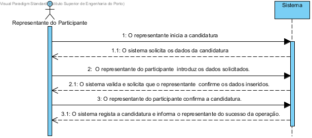

# UC3 Criar candidatura
## Formato breve
O Representante inicia a candidatura.
O sistema pede os dados.
O Representante introduz os dados.
O sistema valida e pede confirmação.
O Representante confirma.
O sistema guarda a candidatura e apresenta sucesso.
## SSD de formato breve

## Formato completo

### Ator principal
* Representante do participante

### Partes interessadas e seus interesses
+ Representante do participante: Pretende criar uma candidatura  para que possa vir a participar num dos eventos registados na aplicação.
+ Centro de Eventos: Pretende que fique registado a candidatura para que possa ser avalida e se for aprovada atribuir um stand no evento ao participante candidato.

### Pré-condições
+ A candidatura não pode estar já efetuada.
+ O evento para o qual será feita a candidatura tem de estar criado na aplicação.

### Pós-condições
* O registo da candidatura fica armezenado no sistema.

### Cenário de sucesso principal (ou fluxo básico)
1. O representante do participante inicia o registo da candidatura.
2. O sistema solicita os dados da candidatura.
3. O representante do participante (com a candidatura não registada) introduz os dados solicitados.
4. O sistema valida e solicita que o representante do participante (com a candidatura não registada) confirme os dados inseridos.
5. O representante do participante (com a candidatura não registada) confirma a candidatura.
6. O sistema regista a candidatura e informa o representante do participante do sucesso da operação.

### Extensões (ou fluxos alternativos)
\*a. O representante do participante (com a candidatura não registada) solicita cancelamento do registo.

+ O caso de uso termina.

4a. Dados mínimos obrigatórios em falta.

1. O sistema informa quais os dados em falta.
2. O sistema permite a introdução dos dados em falta (passo 3)

    2.a O representante do participante (com a candidatura não registada) não altera os dados. O caso de uso termina.

4b. O sistema detecta que os dados (ou algum subconjunto dos dados) introduzidos devem ser únicos e que já existem no sistema.

1. O sistema alerta O representante do participante para o facto.
2. O sistema permite a sua alteração (passo 3)

    2a. O representante do participante (com a candidatura não registada) não altera os dados. O caso de uso termina.

4c. O sistema detecta que os dados introduzidos (ou algum subconjunto dos dados) são inválidos.

1. O sistema alerta o representante do participante para o facto.
2. O sistema permite a sua alteração (passo 3)

    2a. O representante do participante (com a candidatura não registada) não altera os dados. O caso de uso termina.

## Requisitos especiais
*

## Listas de variações em tecnologias e dados
*

## Frequência de Ocorrência
*

## Questões em aberto
+ O registo de candidaturas deve estar sempre disponível, mesmo que não haja eventos registados no sistema?
+ Quais são os dados obrigatórios para o registo da candidatura?
+ Quais os dados que em conjunto permitem detectar a duplicação de candidaturas?
+ Como é que o representante poderá anular posteriormente a candidatura?
+ Qual a frequência de ocorrência deste caso de uso?
