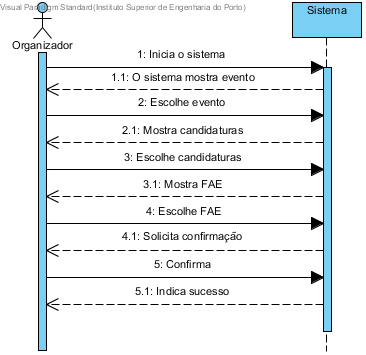

# UC4 Atribuir candidaturas
## Formato breve
O organizador inicia o sistema e atribui as candidaturas de um dos eventos coordenados por ele aos FAE reponsáveis pelo evento para que possa ser avaliada.

## SSD de formato breve

## Formato completo

### Ator principal
* Organizador

### Partes interessadas e seus interesses
+ Organizador: apos atribuircandidaturas pode prosseguir com o seu trabalho de organizar o evento.
+ FAE: é lhes atribuida uma candidatura para avaliarem e decidirem se essa pode participar no evento.
+ Centro de eventos: atribuir candidaturas permite que a organização dos eventos prossiga.

### Pré-condições
+ Ainda não estão atribuidas todas as candidaturas de um determinado evento.

### Pós-condições
+ Ficam atribuidas candidaturas aos FAE

### Cenário de sucesso principal (ou fluxo básico)
1. O organizador inicia o sistema.
2. O sistema fornece a sua lista de eventos.
3. O organizador escolhe um evento.
4. O sistema fornece as candidaturas por atribuir aos FAE desse evento.
5. O organizador escolhe uma candidatura.
6. O sistema fornece a lista de FAE responsáveis por esse evento.
7. O organizador escolhe um FAE para avaliar a candidatura.
8. O sistema retira a candidatura da lista de candidaturas por atribuir.
9. Os passos 4 a 8 repetem-se até todas as candidaturas terem sido atribuidas.
10. O sistema solicita confirmação da operação.
11. O organizador confirma a operação.
12. O sistema indica sucesso.

### Extensões (ou fluxos alternativos)
\*a. O utilizador (não registado) solicita cancelamento do registo.

+ O caso de uso termina.

## Requisitos especiais
*
## Listas de variações em tecnologias e dados
*
## Frequência de Ocorrência
*
## Questões em aberto
+ O organizador pode deixar candidaturas por atribuir?
+ Quão frequente é a ocurrencia deste caso de uso?
+ O organizador tem que atribuir todas as candidaturas de uma vez ou pode parar e continuar posteriormente?
