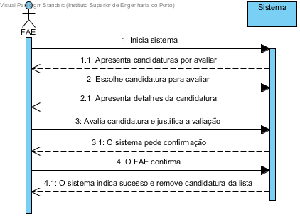

# UC5 Avaliar candidaturas
## Formato breve
O FAE fornece-lhe as candidaturas que lhe foram atribuidas. Após avaliar as candidaturas o FAE indica no sistema para cada uma se foi aceite ou recusada junto com um texto justificativo.
## SSD de formato breve

## Formato completo

### Ator principal
* FAE

### Partes interessadas e seus interesses
+ FAE: avalia a candidatura para atribuir o espaço no evento.
+ Participante: ser aceite no evento.
+ Centro de eventos: poder prosseguir com a organização sabendo quem serão os participantes.

### Pré-condições
+ Há candidaturas por avaliar.

### Pós-condições
+ As candidaturas encontram-se avaliadas e aceites/recusadas no sistema.

### Cenário de sucesso principal (ou fluxo básico)
1. O FAE inicia o sistema.
2. O sistema apresenta as candidaturas que foram atribuidas ao FAE que ainda não foram avaliadas.
3. O FAE escolhe uma candidatura da lista para avaliar.
4. O sistema apresenta a informação da candidatura
5. O FAE aceita ou recusa a candidatura e justifica com um texto.
6. O sistema pede confirmação.
7. O FAE confirma.
8. O sistema remove a candidatura da lista de candidaturas por avaliar.
9. Os passos 2 a 8 repetem-se até que todas as candidaturas estejam avaliadas.
10. O sistema indica sucesso.

### Extensões (ou fluxos alternativos)
\*a. O FAE solicita cancelamento do registo.

+ O caso de uso termina.

## Requisitos especiais
*

## Listas de variações em tecnologias e dados
*

## Frequência de Ocorrência
*

## Questões em aberto
+ Qual é a frequência de ocorrência este UC?
+ Os FAE tem que avaliar todas as candidaturas de uma vez?
+ A justificação é obrigatória?
+ É possivel cancelar candidaturas e que impacto é que tem se ja tiverem sido aprovadas?
