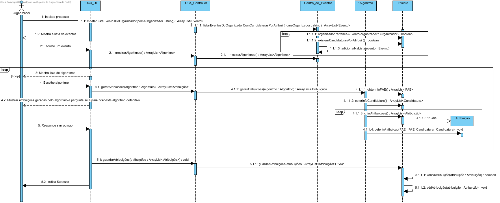
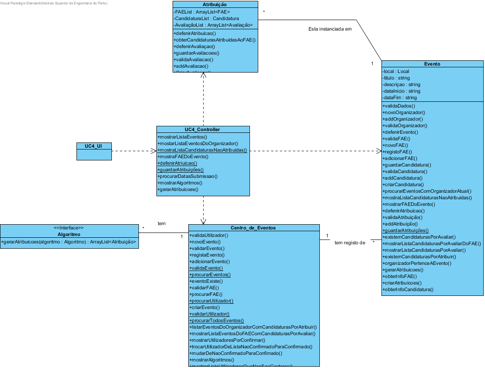

# Design UC4 - Atribuir candidaturas aos FAE

## Racional ##

| Cenário principal                                                                                                                                                       | Questão: Que classe deve...                               | Resposta          | Justificação                                                                                |
|-------------------------------------------------------------------------------------------------------------------------------------------------------------------------|-----------------------------------------------------------|-------------------|---------------------------------------------------------------------------------------------|
| 1. O organizador inicia a atribuição de candidaturas a FAE.                                                                                                             | n/a                                                       |                   |                                                                                             |
| 2. O sistema fornece a sua lista de eventos com candidaturas por atribuir e cuja a data de submissão de candidaturas tenha expirado e solicita a selecção de um evento. | ...procurar os eventos do organizador?                    | Centro de eventos | IE: é a classe reponsável por armazenar todos os eventos criados.                           |
|                                                                                                                                                                         | ...procurar as datas de submissão de candidaturas?        | Evento            | IE: é a classe reponsável por armazenar todos os dados do evento.                           |
| 3. O organizador escolhe um evento.                                                                                                                                     | n/a                                                       |                   |                                                                                             |
| 4. O sistema apresenta uma lista das candidaturas por atribuir aos FAE desse evento.                                                                                    | ...procurar as candidaturas por atribuir do evento?       | Evento            | IE: é a classe responsável por armazenar todas as candidaturas do evento.                   |
| 5. O organizador escolhe uma candidatura.                                                                                                                               | n/a                                                       |                   |                                                                                             |
| 6. O sistema mostra os algoritmos de atribuição de candidaturas disponiveis.                                                                                            | ...executar o algoritmo?                                  | Algoritmo         | IE: é a classe responsável por armazenar todas as funcionalidades do algoritmo.             |
| 7. O organizador escolhe um algoritmo.                                                                                                                                  | n/a                                                       |                   |                                                                                             |
| 8. O sistema atribui a candidatura ao FAE com base no algoritmo.                                                                                                        | ...armazenar a candidatura por avaliar e o respetivo FAE? | Atribuição        | Creator                                                                                     |
| 9. Os passos 4 a 8 repetem-se até todas as candidaturas do evento terem sido atribuidas.                                                                                | n/a                                                       |                   |                                                                                             |
| 10. O sistema apresenta as atribuições definidas e solicita confirmação.                                                                                                | n/a                                                       |                   |                                                                                             |
| 11. O organizador confirma.                                                                                                                                             | n/a                                                       |                   |                                                                                             |
| 12. O sistema regista as atribuições de candidaturas a FAE e indica sucesso.                                                                                            | ...gravar as atribuições?                                 | Evento            | IE: é a classe responsável por armazenar as atribuições das candidaturas por avaliar e FAE. |

##	Diagrama de Sequência ##

##	Diagrama de Classes ##

