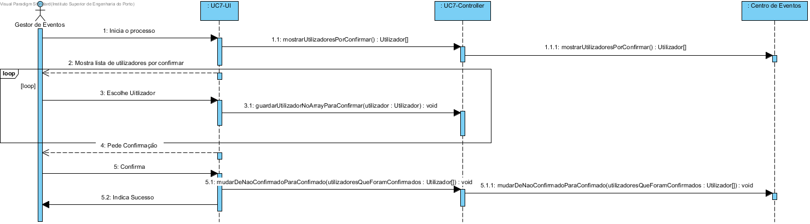
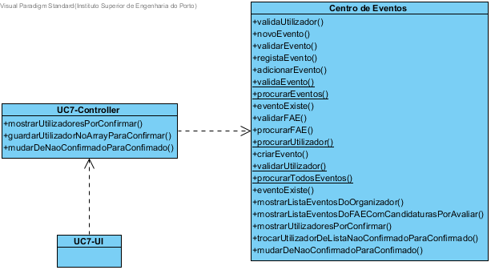

# Design UC7 - Confirmar registo de utilizador

## Racional ##

| Cenário principal                                                                     | Questão: Que classe deve...                 | Resposta          | Justificação                                                                   |
|---------------------------------------------------------------------------------------|---------------------------------------------|-------------------|--------------------------------------------------------------------------------|
| 1. O gestor inicia a confirmação de registo de utilizador.                            | n/a                                         |                   |                                                                                |
| 2. O sistema apresenta a lista de utilizadores não confirmados.                       | ...procurar os utilizadores não registados? | Centro de eventos | IE: é a classe responsável por armazenar todos os utilizadores não registados. |
| 3. O gestor seleciona o utilizador.                                                   | n/a                                         |                   |                                                                                |
| 4. O sistema remove o utilizador da lista de utilizadores não registados.             | n/a                                         |                   |                                                                                |
| 5. Os passos 2 a 4 repetem-se até os utilizadores estarem confirmados.                | n/a                                         |                   |                                                                                |
| 6. O sistema mostra todos os utilizadores que foram avaliados e solicita confirmação. | n/a                                         |                   |                                                                                |
| 7. O gestor confirma.                                                                 | n/a                                         |                   |                                                                                |
| 8. O sistema guarda os utilizadores como registados e indica sucesso.                | ...guardar os utilizadores registados?      | Centro de eventos | IE: é a classe responsável por armazenar todos os utilizadores registados.     |

##	Diagrama de Sequência ##

##	Diagrama de Classes ##

