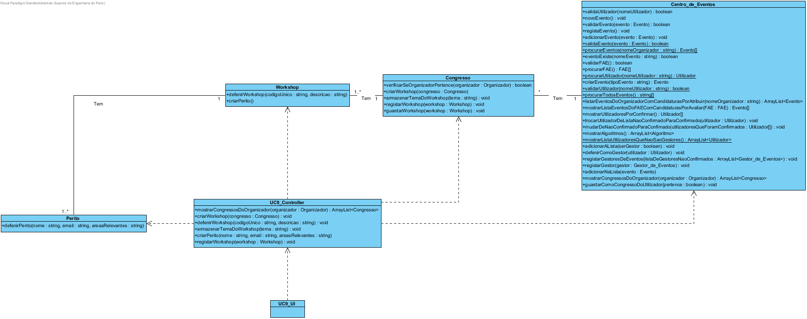

# Design UC9 - Criar Workshop

## Racional ##

| Cenário principal                                                                                     | Questão: Que classe deve...      | Resposta          | Justificação                                                                      |
|-------------------------------------------------------------------------------------------------------|----------------------------------|-------------------|-----------------------------------------------------------------------------------|
| 1. O Organizador inicia o registo do worhshop.                                                        | n/a                              |                   |                                                                                   |
| 2. O sistema mostra os congressos organizados pelo organizador.                                       | ...procurar os congressos?       | Centro de eventos | IE: é a classe que contem todos os eventos criados.                               |
|                                                                                                       | ...procurar o organizador?       | Congresso         | IE: é a classe que contem os organizadores encarregues deste evento.              |
| 3. O Organizador escolhe um evento.                                                                   | n/a                              |                   |                                                                                   |
| 4. O sistema pede os dados do workshop(código único e descrição).                                     | ...armazenar os dados?           | Workshop          | IE: é a classe que contem todos os dados do workshop.                             |
|                                                                                                       | ...instanciar o workshop?        | Congresso         | Creator                                                                           |
| 5. O Organizador introduz os dados.                                                                   | n/a                              |                   |                                                                                   |
| 6. O sistema pede o tema do workshop.                                                                 | ...armazenar o tema?             | Congresso         | IE: é a classe que contem todos os temas do workshop.                             |
| 7. O Organizador introduz o tema do workshop.                                                         | n/a                              |                   |                                                                                   |
| 8. Os passos 6 a 7 repetem-se até todos os temas terem sido introduzidos.                             | n/a                              |                   |                                                                                   |
| 9. O sistema pede os dados do perito do workshop.                                                     | ...armazenar os dados do perito? | Perito            | IE: é a classe responsável por armazenar todos os dados do perito.                |
|                                                                                                       | ...instanciar o perito?          | Workshop          | Creator                                                                           |
| 10. O Organizador introduz os dados do perito do workshop(nome, email e áreas de perícia relevantes). | n/a                              |                   |                                                                                   |
| 11. Os passos 9 a 10 repetem-se até todos os peritos,terem sido introduzidos.                         | n/a                              |                   |                                                                                   |
| 12. O sistema mostra o workshop criado e pede confirmação.                                            | n/a                              |                   |                                                                                   |
| 13. O Organizador confirma.                                                                           | n/a                              |                   |                                                                                   |
| 14. O sistema regista o workshop no congresso e apresenta sucesso.                                    | ...registar o workshop?          | Congresso         | IE: é a classe responsável por armazenar todos os workshops criados do congresso. |

##	Diagrama de Sequência ##

##	Diagrama de Classes ##

