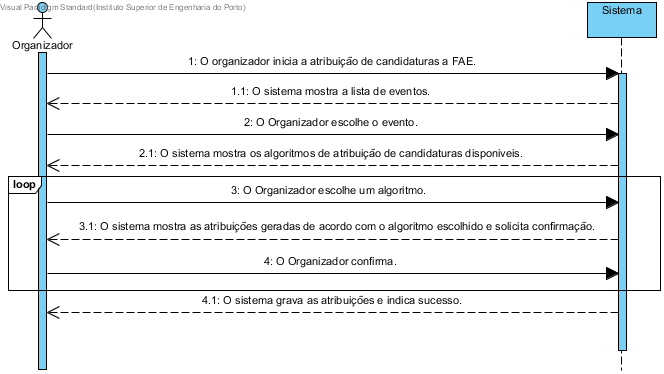

# UC4 Atribuir Candidaturas
## Formato breve
O organizador inicia a atribuição de candidaturas a FAE.
O sistema mostra a lista de eventos.
O Organizador escolhe o evento.
O sistema mostra os algoritmos de atribuição de candidaturas disponiveis.
O Organizador escolhe um algoritmo.
O sistema mostra as atribuições geradas de acordo com o algoritmo escolhido e solicita confirmação.
O Organizador confirma.
O sistema grava as atribuições e indica sucesso.

## SSD de formato breve

## Formato completo

### Ator principal
* Organizador

### Partes interessadas e seus interesses
+ Organizador: apos atribuir candidaturas pode prosseguir com o seu trabalho de organizar o evento.
+ FAE: é lhes atribuida uma candidatura para avaliarem e decidirem se essa pode participar no evento.
+ Centro de eventos: atribuir candidaturas permite que a organização dos eventos prossiga.

### Pré-condições
+ Ainda não estão atribuidas todas as candidaturas de um determinado evento.

### Pós-condições
+ Ficam atribuidas candidaturas aos FAE

### Cenário de sucesso principal (ou fluxo básico)
1. O organizador inicia a atribuição de candidaturas a FAE.
2. O sistema fornece a sua lista de eventos com candidaturas por atribuir e cuja a data de submissão de candidaturas tenha expirado e solicita a selecção de um evento.
3. O organizador escolhe um evento.
4. O sistema mostra os algoritmos de atribuição de candidaturas disponiveis.
5. O organizador escolhe um algoritmo.
6. O sistema mostra as atribuições geradas de acordo com o algoritmo escolhido e pergunta se este deve ser considerado de forma definitiva.
7.  O Organizador responde à pergunta.
8. Os passos 4 a 7 são repetidos até à escolha definitiva do resultado do algoritmo.  
9. O sistema guarda as atribuições geradas, informando do sucesso da operação.

### Extensões (ou fluxos alternativos)
\*a. O utilizador (não registado) solicita cancelamento do registo.

+ O caso de uso termina.

10a. O organizador não confirma.
1. Nada é guardado permanentemente e os registos temporarios sao apagados.
## Requisitos especiais
*
## Listas de variações em tecnologias e dados
*
## Frequência de Ocorrência
*
## Questões em aberto
+ O organizador pode deixar candidaturas por atribuir?
+ Quão frequente é a ocurrencia deste caso de uso?
+ O organizador tem que atribuir todas as candidaturas de uma vez ou pode parar e continuar posteriormente?
