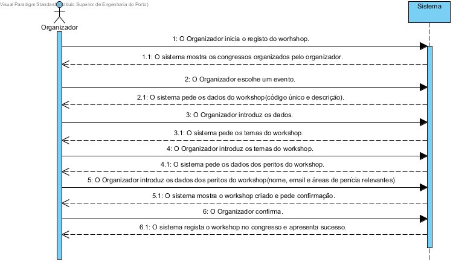

# UC9 Criar Workshop
## Formato breve
O Organizador inicia o registo do worhshop.
O sistema mostra os congressos organizados pelo organizador.
O Organizador escolhe um evento.
O sistema pede os dados do workshop.
O Organizador introduz os dados.
O sistema mostra o workshop criado e pede confirmação.
O Organizador confirma.
O sistema regista o workshop no congresso e apresenta sucesso.
## SSD de formato breve

## Formato completo

### Ator principal
* Organizador

### Partes interessadas e seus interesses
+ Organizador: Pretende criar um Workshop para que seja registado no congresso.
+ Centro de Eventos: Pretende que fique registado o Workshop do congresso.

### Pré-condições
+ O Workshop em questão não pode estar já registado.
+ O evento(congresso) para o qual será criado o Workshop tem de estar criado na aplicação.

### Pós-condições
* O registo do Workshop fica armezenado no sistema.

### Cenário de sucesso principal (ou fluxo básico)
1. O Organizador inicia o registo do worhshop.
2. O sistema mostra os congressos organizados pelo organizador.
3. O Organizador escolhe um evento.
4. O sistema pede os dados do workshop.
5. O Organizador introduz os dados.
6. Os passos 3 a 5 repetem-se até todos os Workshops do congresso estarem introduzidos.
7. O sistema mostra os workshops criados e pede confirmação.
8. O Organizador confirma.
9. O sistema regista o workshop no congresso e apresenta sucesso.

### Extensões (ou fluxos alternativos)
\*a. O representante do participante (com a candidatura não registada) solicita cancelamento do registo.

+ O caso de uso termina.

5a. Dados mínimos obrigatórios em falta.

1. O sistema informa quais os dados em falta.
2. O sistema permite a introdução dos dados em falta (passo 4)

    2.a O Organizador não altera os dados. O caso de uso termina.

5b. O sistema detecta que os dados (ou algum subconjunto dos dados) introduzidos devem ser únicos e que já existem no sistema.

1. O sistema alerta o Organizador para o facto.
2. O sistema permite a sua alteração (passo 4)

    2a. O Organizador não altera os dados. O caso de uso termina.

5c. O sistema detecta que os dados introduzidos (ou algum subconjunto dos dados) são inválidos.

1. O sistema alerta o Organizador para o facto.
2. O sistema permite a sua alteração (passo 4)

    2a. O Organizador não altera os dados. O caso de uso termina.

8a. O Organizador não confirma.
1. Nada é guardado permanentemente e os registos temporarios sao apagados.

## Requisitos especiais
*

## Listas de variações em tecnologias e dados
*

## Frequência de Ocorrência
*

## Questões em aberto
+ Quais são os dados obrigatórios para o registo do Workshop?
+ Quais os dados que em conjunto permitem detectar a duplicação de Workshops?
+ Como é que o Organizador poderá anular posteriormente o Workshop?
+ Qual a frequência de ocorrência deste caso de uso?
