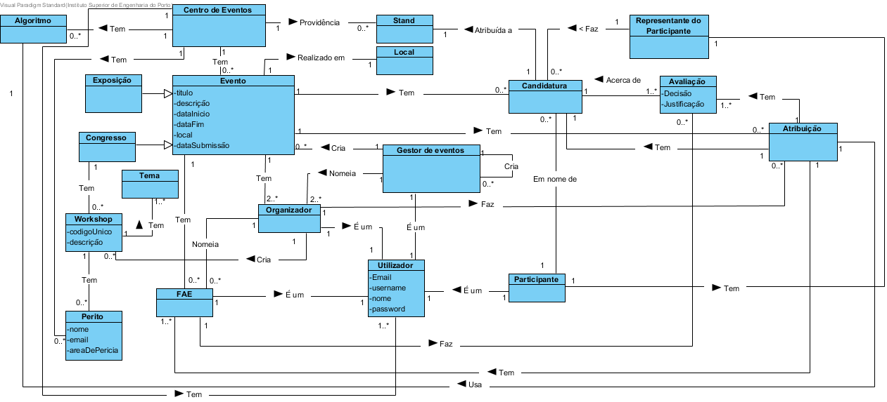

# Análise OO
## Tabela de Categorias
| Categoria                                                         | Conceito |
|-------------------------------------------------------------------|----------|
| Transações(do negócio)                                            |Candidatura, Decisão de candidatura, Atribuição|
| Linhas de transações                                              |     /    |
| Produtos ou serviços relacionados com transações                  |   Stand, Workshop    |
| Registos (de transações)                                          |     /    |
| Papéis das pessoas                                                |Utilizador, Gestor de eventos, Organizadores, FAE, Representante do Participante, Peritos|
| Lugares                                                           |Local,Centro de eventos|
| Eventos                                                           |Eventos(Congressos ou Exposições)   |
| Objetos físicos                                                   |     /    |
| Especificações e descrições                                       |     /    |
| Catálogos                                                         |     /    |
| Conjuntos (containers)                                            |Registo   |
| Elementos de conjuntos                                            |     /    |
| (Outras) Organizações                                             |Participantes|
| Outros sistemas (externos)                                        |     /    |
| Registos (financeiros), de trabalho, contratos, documentos legais |Registo de utilizadores|
| Intrumentos financeiros                                           |     /    |
| Documentos referidos/para executar as tarefas                     |     /    |

## Tabela de conceitos

| Conceito 1                                           | Associação    | Conceito 2         |
|------------------------------------------------------|---------------|--------------------|
| Centro de eventos                                    | Tem           | Algoritmo          |
|                                                      | Providência   | Stands             |
|                                                      | Tem           | Utilizador         |  
|                                                      | Tem           | Eventos            |
| Gestor de eventos                                    | Cria          | Evento             |
|                                                      | Nomeia        | Organizadores      |
|                                                      | Cria          | Gestor de eventos  |
|                                                      | É um          | Utilizador         |
| Evento                                               | Tem           | Organizador        |
|                                                      | Realizado em  | Local              |
|                                                      | Tem           | FAE                |
|                                                      | Tem           | Atribuição         |
|                                                      | É uma         | Exposição          |
|                                                      | É um          | Congresso          |
|                                                      | Tem           | Candidatura        |
| Organizador                                          | Nomeam        | FAE                |
|                                                      | Distribui     | FAE                |
|                                                      | É um          | Utilizador         |
|                                                      | Cria          | Workshop           |
|                                                      | Faz           | Atribuição         |
| Representante                                        | Faz           | Candidatura        |
| Congresso                                            | Tem           | Workshop           |
| Participante                                         | Tem           | Representante      |
|                                                      | É um          | Utilizador         |
| FAE                                                  | Faz           | Avaliação          |
|                                                      | É um          | Utilizador         |
| Candidatura                                          | Em nome de    | Participante       |
| Avaliação                                            | Acerca de     | Candidatura        |
| Atribuição                                           | Tem           | Candidatura        |
|                                                      | Tem           | FAE                |
|                                                      | Usa           | Algoritmo          |
|                                                      | Tem           | Avaliação          |
| Workshop                                             | Tem           | Peritos            |

## Modelo de dominio

