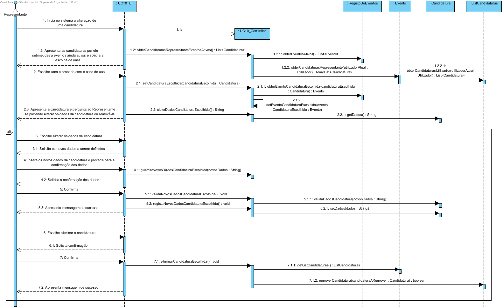
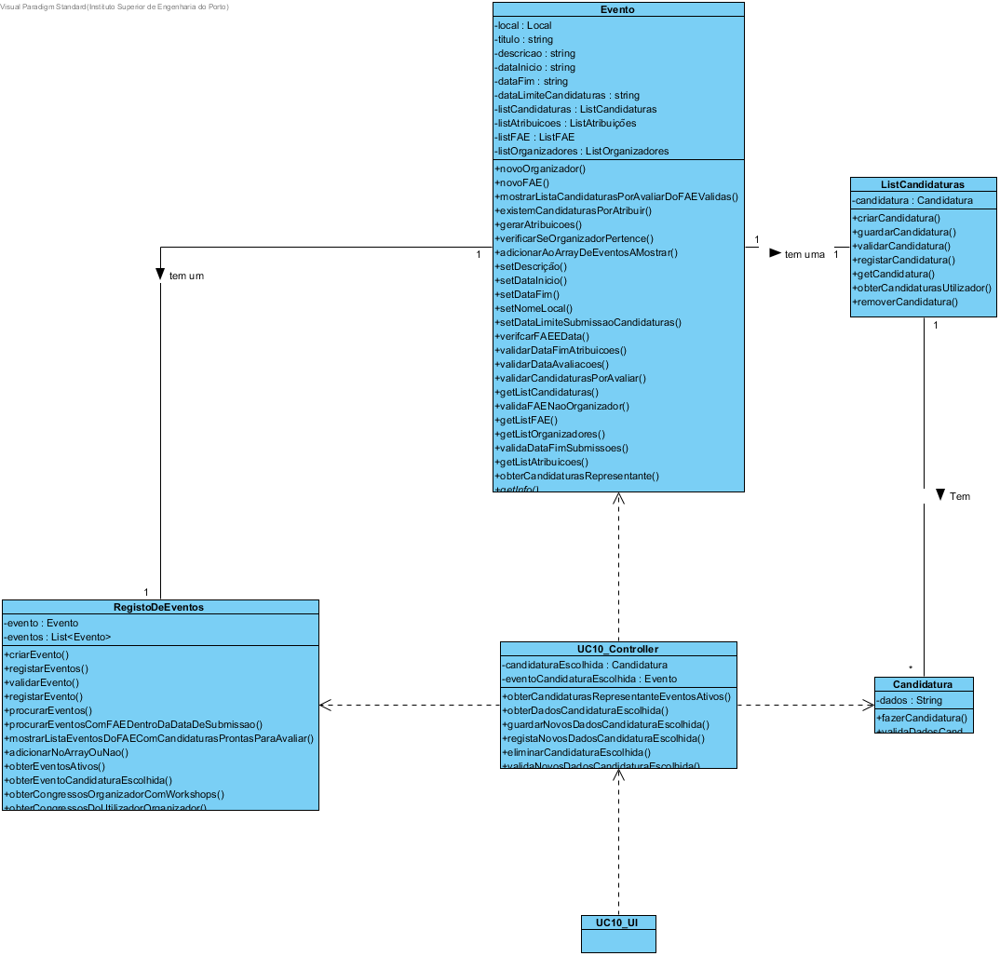

## Tabela de responsabilidades do caso de uso UC10 - Alterar candidatura

| Fluxo principal                                                                                                                                                                                                                   | Questão: Que classe…                                                           | Resposta                            | Justificação                                                                                           |
|-----------------------------------------------------------------------------------------------------------------------------------------------------------------------------------------------------------------------------------|--------------------------------------------------------------------------------|-------------------------------------|--------------------------------------------------------------------------------------------------------|
| 1. O representante do participante inicia no sistema a alteração de uma candidatura.                                                                                                                                              | -                                                                              | -                                   | -                                                                                                      |
| 2. O sistema apresenta as candidaturas submetidas pelo representante aos eventos cujo período de submissão de candidaturas ainda não terminou e solicita a escolha de uma.                                                        | ... tem a informação relativa ao representante que submeteu certa candidatura? | Candidatura                         | I.E. - Guarda a instância de Representante que a submeteu                                              |
|                                                                                                                                                                                                                                   | ... guarda as candidaturas submetidas a um evento?                             | Evento/ListaCandidaturas            | I.E., L.S., H.C.                                                                                       |
|                                                                                                                                                                                                                                   | ... sabe o período de submissão de candidaturas de cada evento?                | Evento                              | I.E. - No momento de criação de um evento, é definido a data de limite de submissão de candidaturas    |
| 3. O representante seleciona uma das apresentadas.                                                                                                                                                                                | -                                                                              | -                                   | -                                                                                                      |
| 4. O sistema apresenta a candidatura escolhida e pergunta ao representante se pretende alterar os dados da candidatura ou remover a candidatura.                                                                                  | ... sabe os dados da candidatura?                                              | Candidatura                         | I.E.                                                                                                   |
| 5. O representante escolhe entre alterar os dados da candidatura, sendo-lhe requisitado pelo sistema que introduza os novos dados, sendo estes, por sua vez, posteriormente validados ou escolhe eliminar a candidatura indicada. | -                                                                              | -                                   | -                                                                                                      |
| 7. O sistema solicita a confirmação da alteração realizada.                                                                                                                                                                       | -                                                                              | -                                   | -                                                                                                      |
| 8. O representante confirma.                                                                                                                                                                                                      | -                                                                              | -                                   | -                                                                                                      |
| 9. O sistema guarda os novos dados da respetiva candidatura ou elimina a candidatura indicada do sistema e apresenta uma mensagem de sucesso.                                                                                     | ... guarda os novos dados da candidatura alterada?                             | Candidatura                         | I.E. - A candidatura cujos dados foram alterados, guarda os novos dados                                |
|                                                                                                                                                                                                                                   | ... elimina a candidatura do sistema?                                          | Centro de Eventos/ListaCandidaturas | I.E. - O objeto ListaCandidaturas vai remover a candidatura desejada do conjunto total de candidaturas |

##	Diagrama de Sequência ##

##	Diagrama de Classes ##

