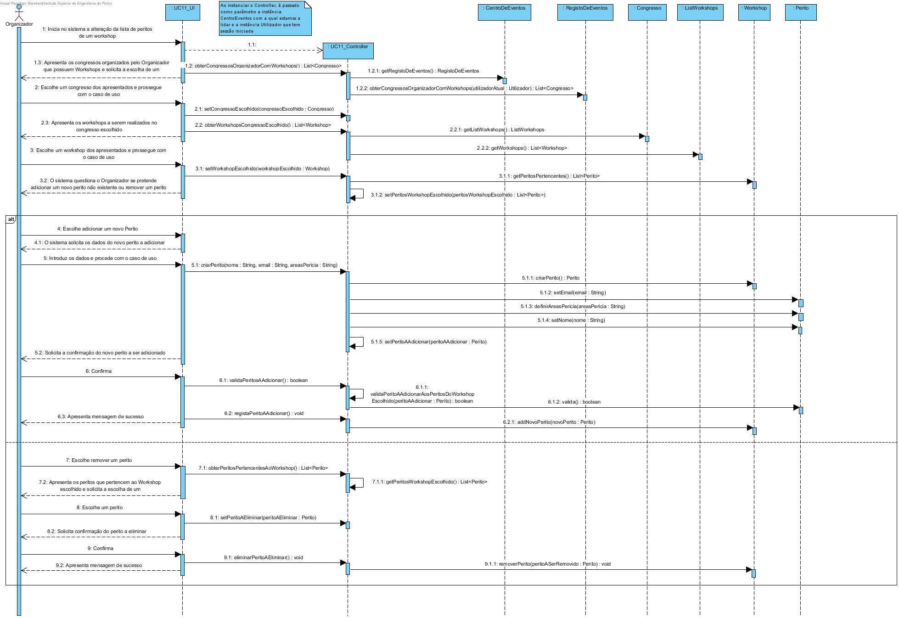

## Tabela de responsabilidades do caso de uso UC11 - Alterar lista de peritos de workshop

| Fluxo principal                                                                                                                                           | Questão: Que classe…                                            | Resposta                                   | Justificação                                                                                                                                                             |
|-----------------------------------------------------------------------------------------------------------------------------------------------------------|-----------------------------------------------------------------|--------------------------------------------|--------------------------------------------------------------------------------------------------------------------------------------------------------------------------|
| 1. O organizador inicia no sistema a alteração da lista de peritos de um workshop.                                                                        | -                                                               | -                                          | -                                                                                                                                                                        |
| 2. O sistema apresenta os congressos organizados pelo Organizador que possuem workshops e solicita a escolha de um.                                       | ... guarda os congressos do Centro de Eventos?                  | Centro de Eventos/ListaEventos             | I.E. , L.S., H.C.                                                                                                                                                        |
|                                                                                                                                                           | ... sabe que Congressos possuem workshops?                      | Congresso/ListaWorkshops                   | I.E., L.S., H.C. - Cada congresso possui a informação sobre os Workshops a serem realizados durante o congresso.                                                         |
|                                                                                                                                                           | ... sabe quais congressos são organizados pelo Organizador?     | Centro de Eventos/ListaEventos/Organizador | I.E. - Cada instância de Congresso tema informação para o conjunto de organizadores a ele pertencentes.                                                                  |
| 3. O organizador escolhe um congresso.                                                                                                                    | -                                                               | -                                          | -                                                                                                                                                                        |
| 4. O sistema apresenta os workshops a serem organizados no congresso escolhido e solicita a escolha de um.                                                | ... guarda os workshops a tomarem lugar no congresso escolhido? | Congresso/ListaWorkshops                   | I.E., L.S., H.C. - Cada congresso possui a informação sobre os Workshops a serem realizados durante o congresso.                                                         |
| 5. O organizador escolhe um workshop dos apresentados.                                                                                                    | -                                                               | -                                          | -                                                                                                                                                                        |
| 6. O sistema questiona o Organizador o que pretende alterar em relação à lista de peritos do workshop escolhido.                                          | -                                                               | -                                          | -                                                                                                                                                                        |
| 7. O organizador ou escolhe adicionar um novo perito inexistente em sistema sendo este posteriormente validado ou escolhe eliminar um perito do workshop. | ... valida os dados do novo perito inserido?                    | RegistoPerito/Perito                       | I.E. - Validação global (verifica se o email do novo perito a ser adicionado já existe em sistema) e validação local pela classe Perito (dados em falta, inválidos etc.) |
| 8. O sistema solicita confirmação das alterações realizadas à lista de peritos do workshop escolhido.                                                     | -                                                               | -                                          | -                                                                                                                                                                        |
| 9. O organizador confirma.                                                                                                                                | -                                                               | -                                          | -                                                                                                                                                                        |
| 10. O sistema ou regista o novo perito a ser adicionado, ou guarda as alterações realizadas ao perito selecionado ou remove o perito indicado.            | ... regista o novo perito?                                      | Workshop/ListaPeritos                      | I.E. - O novo perito criado é adicionado ao conjunto de peritos que foram indicados para organizarem o workshop em questão                                               |
|                                                                                                                                                           | ... vai remover um perito?                                      | Workshop/ListaPeritos                      | I.E. - O objeto ListaWorkshop irá remover o Workshop desejado.                                                                                                           |

##	Diagrama de Sequência ##

##	Diagrama de Classes ##

