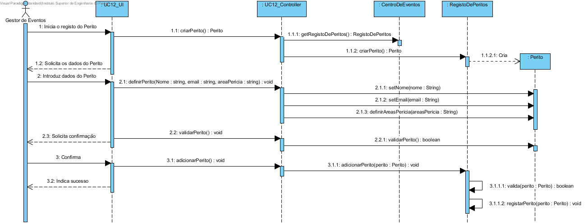
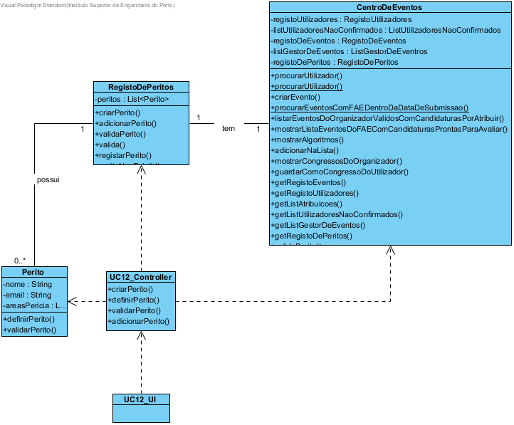

# Design UC12 - Registar Perito

## Racional ##

| Cenário principal                                                                    | Questão: Que classe deve... | Resposta         | Justificação                                                          |
|--------------------------------------------------------------------------------------|-----------------------------|------------------|-----------------------------------------------------------------------|
| 1. O Gestor de Eventos inicia no sistema o registo do Perito.                        | n/a                         |                  |                                                                       |
| 2. O sistema solicita os dados do Perito(nome, email e áreas de perícia relevantes). | ...armazenar os dados?      | Perito           | IE: é a classe responsável por armazenar todos os dados do Perito.    |
|                                                                                      | ...instanciar o Perito?     | RegistoDePeritos | Creator                                                               |
| 3. O Gestor de Eventos introduz os dados solicitados.                                | n/a                         |                  |                                                                       |
| 4. O sistema valida e solicita que o Gestor de Eventos confirme os dados inseridos.  | ...validar o Perito?        | RegistoDePeritos | IE: é a classe responsável por armazenar todos os Peritos do sistema. |
| 5. O Gestor de Eventos confirma os dados.                                            | n/a                         |                  |                                                                       |
| 6. O sistema regista o Perito e informa o Gestor do sucesso da operação.             | ...registar o Perito?       | RegistoDePeritos | IE: é a classe responsável por armazenar todos os Peritos do Sistema. |

##	Diagrama de Sequência ##

##	Diagrama de Classes ##

