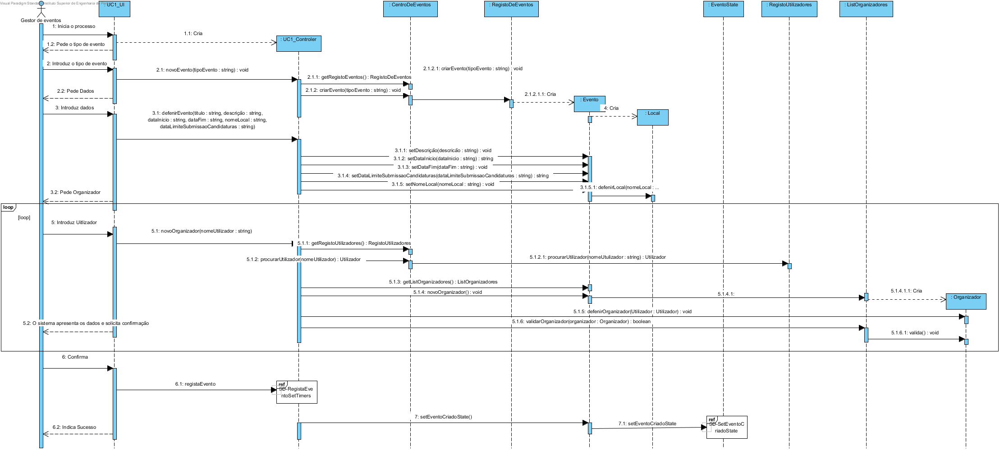
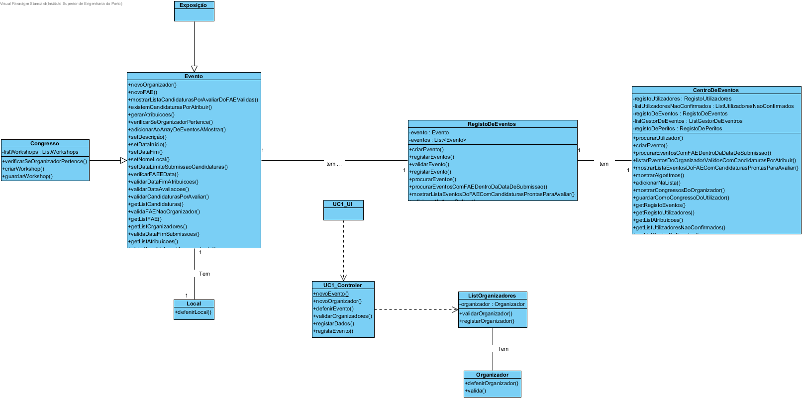

# Design UC1 - Criar Evento

## Racional ##

| Cenário principal                                                                                                                                         | Questão: Que classe deve...  | Resposta          | Justificação                                                                    |
|-----------------------------------------------------------------------------------------------------------------------------------------------------------|------------------------------|-------------------|---------------------------------------------------------------------------------|
| 1. O gestor de eventos inicia o registo do evento.                                                                                                        | n/a                          |                   |                                                                                 |
| 2. O sistema solicita o tipo de evento(Congresso ou Exposição).                                                                                           | ...instanciar o evento?      | RegistoDeEventos  | Creator                                                                         |
| 3. O gestor de eventos seleciona o tipo de evento.                                                                                                        | n/a                          |                   |                                                                                 |
| 4. O sistema solicita os dados do evento(titulo, descrição, data de inicio, data de fim, data limite de submissão de candidaturas, data limite de atribuições, data limite de avaliações e local de realização). | ...armazenar os dados?       | Evento            | IE: é a classe responsável por armazenar todos os dados do evento.              |
| 5. O gestor de eventos introduz os dados solicitados.                                                                                                     | n/a                          |                   |                                                                                 |
| 6. O sistema solicita um organizador para o evento.                                                                                                       | n/a                          |                   |                                                                                 |
| 7. O gestor de eventos insere um organizador.                                                                                                             | n/a                          |                   |                                                                                 |
| 8. O sistema valida o organizador e adiciona-o ao evento.                                                                                                 | ...procurar o utilizador?    | RegistoDeUtilizadores | IE: classe que armazena os utilizadores criados                             |
|                                                                                                                                                           | ...guardar o utilizador?     | Organizador       | IE: classe que armazena a referencia do utilizador que é organizador do evento. |
|                                                                                                                                                           | ...instanciar o organizador? | ListOrganizadores   | Creator                                                                       |
|                                                                                                                                                           | ...validar o organizador?    | ListOrganizadores   | IE: classe que armazena os organizadores do evento                            |
| 9. Os passos 6 a 8 repetem-se até que todos os organizadores tenham sido adicionados e no minimo tenham sido adicionados dois organizadores ao evento.    | n/a                          |                   |                                                                                 |
| 10. O sistema apresenta todos os dados e solicita confirmação do gestor.                                                                                  | n/a                          |                   |                                                                                 |
| 11. O gestor confirma os dados.                                                                                                                           | n/a                          |                   |                                                                                 |
| 12. O sistema regista o novo evento e informa o gestor do sucesso da operação.                                                                            | ...registar o evento?        | RegistoDeEventos  | IE: classe que armazena todos os eventos                                        |

##	Diagrama de Sequência ##

##	Diagrama de Classes ##

