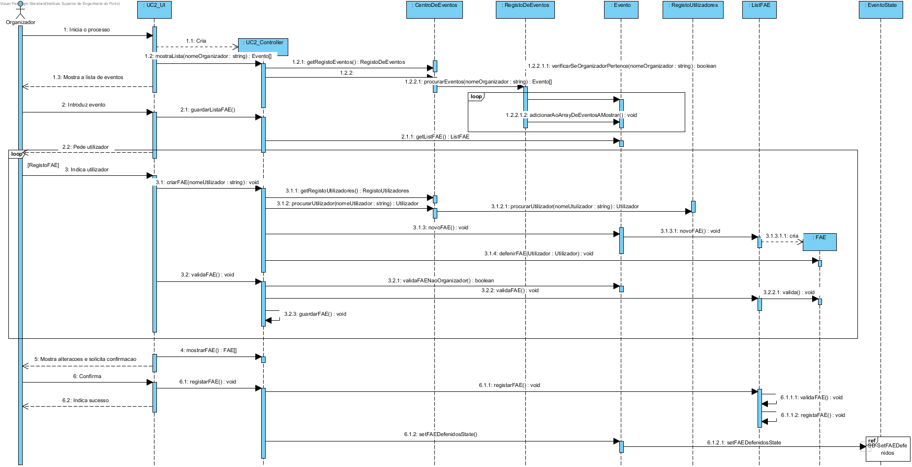
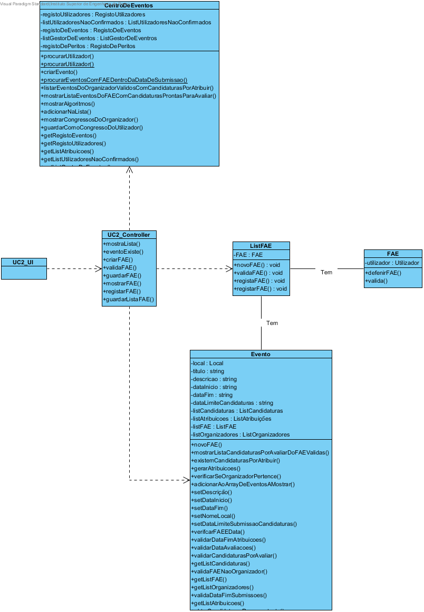

# Design UC2 - Atribuir FAE a evento

## Racional ##

| Cenário principal                                                          | Questão: Que classe deve...               | Resposta          | Justificação                                                      |
|----------------------------------------------------------------------------|-------------------------------------------|-------------------|-------------------------------------------------------------------|
| 1. O organizador inicia o sistema.                                         | n/a                                       |                   |                                                                   |
| 2. O sistema procura os eventos do organizador e mostra a lista de eventos.| ...procurar os eventos do organizador?    | RegistoDeEventos  | IE: é a classe responsável por armazenar todos os eventos criados.|
| 3. O organizador selecciona o evento.                                      | n/a                                       |                   |                                                                   |
| 4. O sistema pede a identificação do utilizador.                           | n/a                                       |                   |                                                                   |
| 5. O organizador introduz o utilizador.                                    | n/a                                       |                   |                                                                   |
| 6. O sistema valida o utilizador e adiciona-o como FAE do evento.          | ...procurar o utilizador?                 | RegistoDeUtilizadores   | IE: é a classe que armazena todos os utilizadores criados.  |
|                                                                            | ...guardar o utilizador?                  |        FAE        | IE: classe que armazena a referencia do utilizador que é FAE do evento.|
|                                                                            | ...instanciar o FAE?                      |       ListFAE     | Creator                                                           |
|                                                                            | ...armazenar os FAE atribuídos ao evento? |       ListFAE     | IE: é a classe que armazena todos os FAE atribuidos ao evento.    |
| 7. Os passos 4 a 6 repetem-se até todos os FAE estarem introduzidos.       | n/a                                       |                   |                                                                   |
| 8. O sistema pede confirmação dos dados introduzidos.                      | n/a                                       |                   |                                                                   |
| 9. O utilizador confirma os utilizadores introduzidos.                     | n/a                                       |                   |                                                                   |
| 10. O sistema regista os FAE e indica sucesso.                             | ...registar os FAE?                       |       ListFAE     | IE: é a classe que armazena todos os FAE atribuidos ao evento     |

##	Diagrama de Sequência ##

##	Diagrama de Classes ##

