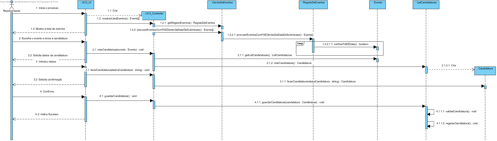

te# Design UC3 - Criar candidatura

## Racional ##

| Cenário Principal                                                                                                                 | Questão: Que classe deve...        | Resposta           | Justificação                                                              |
|-----------------------------------------------------------------------------------------------------------------------------------|------------------------------------|--------------------|---------------------------------------------------------------------------|
| 1. O representante inicia o sistema.                                                                                              | n/a                                |                    |                                                                           |
| 2. O sistema procura e mostra a lista de eventos disponiveis cuja a data de submissão ainda não tenha expirado.                   | ...procurar os eventos existentes? | RegistoDeEventos   | IE: é a classe responsável por armazenar todos os eventos criados.        |
|                                                                                                                                   | ...procurar a data de submissão?   | Evento             | IE: é a classe responsável por armazenar todos os dados do evento.        |
|                                                                                                                                   | ...validar existência de FAE?      | Evento             | IE: é a classe responsável por armazenar todos os dados do evento.        |
| 3. O representante seleciona o evento e inicia o registo da candidatura.                                                          | n/a                                |                    |                                                                           |
| 4. O sistema solicita os dados da candidatura.                                                                                    | ...armazenar os dados?             | Candidatura        | Creator                                                                   |
|                                                                                                                                   | ...instanciar a candidatura?       | ListCandidaturas   | IE: é a classe responsável por armazenar todas as candidaturas do evento. |
| 5. O representante do participante (com a candidatura não registada) introduz os dados solicitados.                               | n/a                                |                    |                                                                           |
| 6. O sistema solicita que o representante do participante (com a candidatura não registada) confirme os dados inseridos.          | n/a                                |                    |                                                                           |
| 7. O representante do participante (com a candidatura não registada) confirma a candidatura.                                      | n/a                                |                    |                                                                           |
| 8. O sistema regista a candidatura e informa o representante do participante do sucesso da operação.                              | ...registar a candidatura?         | ListCandidaturas   | IE: é a classe responsável por armazenar todas as candidaturas do evento. |

##	Diagrama de Sequência ##

##	Diagrama de Classes ##

