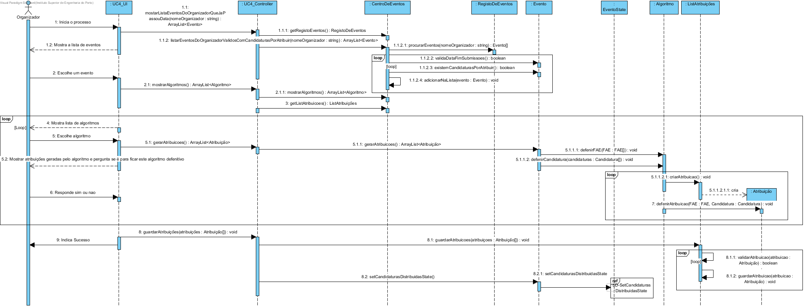
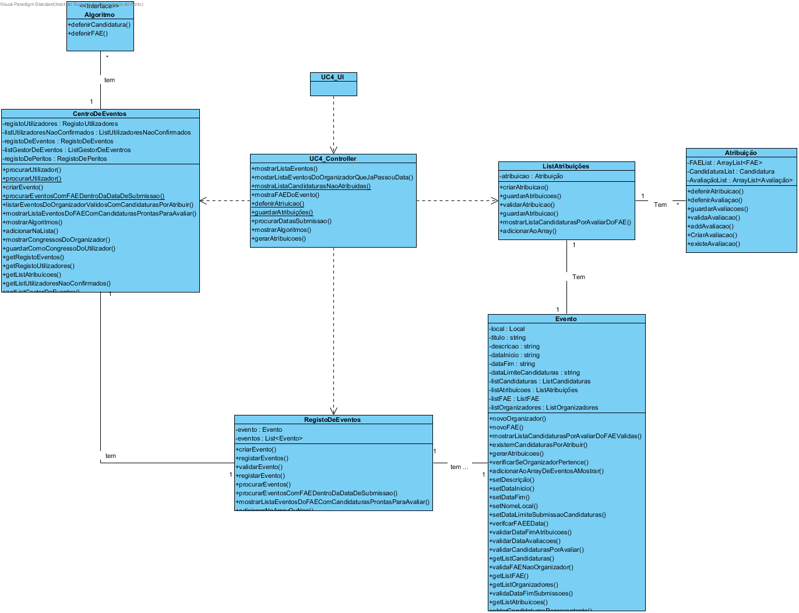

# Design UC4 - Atribuir candidaturas aos FAE

## Racional ##

| Cenário principal                                                                                                                                                       | Questão: Que classe deve...                               | Resposta          | Justificação                                                             |
|-------------------------------------------------------------------------------------------------------------------------------------------------------------------------|-----------------------------------------------------------|-------------------|--------------------------------------------------------------------------|
| 1. O organizador inicia a atribuição de candidaturas a FAE.                                                                                                             | n/a                                                       |                   |                                                                          |
| 2. O sistema fornece a sua lista de eventos com candidaturas por atribuir e cuja a data de submissão de candidaturas tenha expirado e solicita a selecção de um evento. | ...procurar os eventos do organizador?                    | RegistoDeEventos  | IE: é a classe reponsável por armazenar todos os eventos criados.        |
|                                                                                                                                                                         | ...procurar as datas de submissão de candidaturas?        | Evento            | IE: é a classe reponsável por armazenar todos os dados do evento.        |
| 3. O organizador escolhe um evento.                                                                                                                                     | n/a                                                       |                   |                                                                          |
| 4. O sistema mostra os algoritmos de atribuição de candidaturas disponiveis.                                                                                            | ...procurar os algoritmos?                                | Centro de Eventos | IE: é a classe responsável por armazenar todos os algoritmos do sistema. |
| 5. O organizador escolhe um algoritmo.                                                                                                                                  | n/a                                                       |                   |                                                                          |
| 6. O sistema mostra as atribuições geradas de acordo com o algoritmo escolhido e pergunta se este deve ser considerado de forma definitiva.                             | ...armazenar a candidatura por avaliar e o respetivo FAE? | Atribuição        | IE: é a classe responsável por armazenar todos os dados da atribuição.   |
|                                                                                                                                                                         | ...instanciar a atribuição?                               | ListAtribuições   | Creator                                                                  |
| 7.,O Organizador responde à pergunta.                                                                                                                                   | n/a                                                       |                   |                                                                          |
| 8. Os passos 4 a 7 são repetidos até à escolha definitiva do resultado do algoritmo.                                                                                    | n/a                                                       |                   |                                                                          |
| 9. O sistema guarda as atribuições geradas, informando do sucesso da operação.                                                                                          | ...guardar as atribuições?                                | ListAtribuições   | IE: é a classe responsável por armazenar todas as atribuições do evento. |

##	Diagrama de Sequência ##

##	Diagrama de Classes ##

