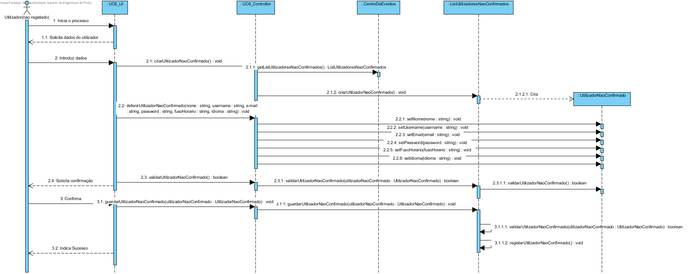
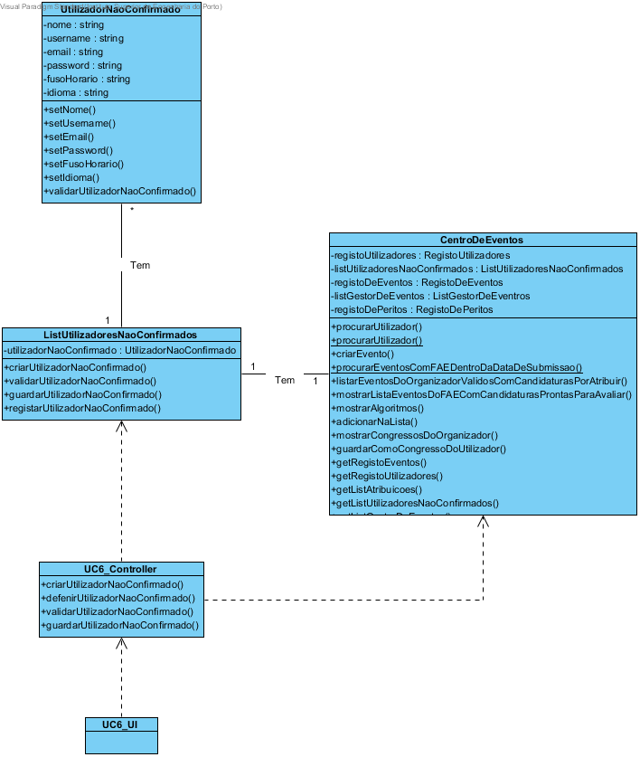

# Realização do UC6 Registar Utilizador #

## Racional ##

| Cenário principal                                                                                       | Questão: Que classe deve... | Resposta              | Justificação                                                        |
|---------------------------------------------------------------------------------------------------------|-----------------------------|-----------------------|---------------------------------------------------------------------|
| 1. O utilizador (não registado) inicia no sistema o seu registo.                                        | n/a                         |                       |                                                                     |
| 2. O sistema solicita os dados do utilizador (nome, username, e-mail, password, fuso horário e idioma). | ...armazenar os dados?      | Utilizador            | IE: é a classe responsável por armazenar os dados de um utilizador. |
|                                                                                                         | ...instanciar o utilizador? | RegistoDeUtilizadores | Creator                                                             |
| 3. O utilizador (não registado) introduz os dados solicitados.                                          | n/a                         |                       |                                                                     |
| 4. O sistema valida e solicita que o utilizador (não registado) confirme os dados inseridos.            | ...validar o utilizador?    | RegistoDeUtilizadores | IE: é a classe responsável por armazenar todos os utilizadores.     |
| 5. O utilizador (não registado) confirma os dados.                                                      |  n/a                           |                       |                                                                     |
| 6. O sistema regista os dados e informa o utilizador (não registado) do sucesso da operação.            | ...registar o utilizador?   | RegistoDeUtilizadores | IE: é a classe responsável por armazenar todos os utilizadores.     |

##	Diagrama de Sequência ##

##	Diagrama de Classes ##

