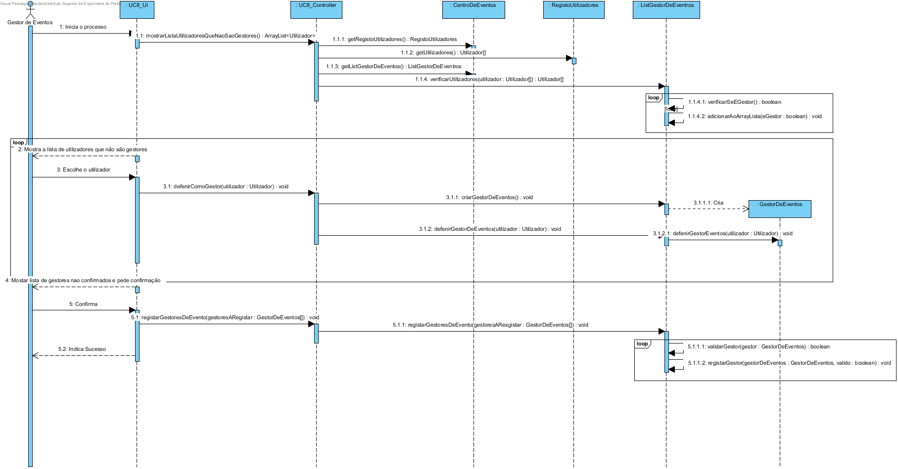
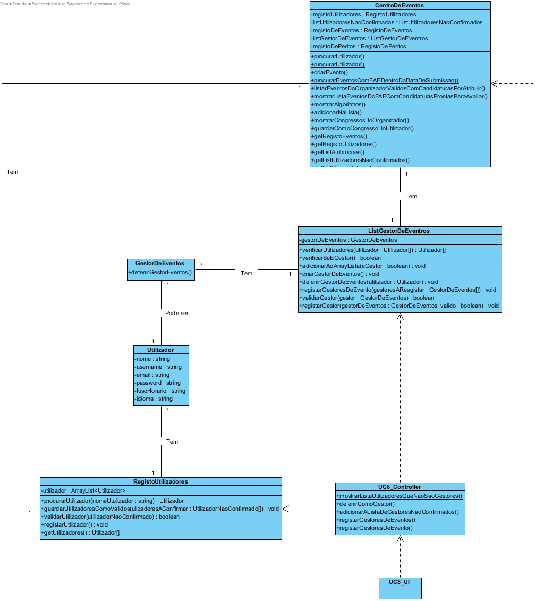

# Design UC8 - Registar Gestor de Eventos

## Racional ##

| Cenário principal                                                                                                  | Questão: Que classe deve...         | Resposta          | Justificação                                                                                     |
|--------------------------------------------------------------------------------------------------------------------|-------------------------------------|-------------------|--------------------------------------------------------------------------------------------------|
| 1. O gestor de eventos inicia o registo de um novo gestor de eventos.                                              | n/a                                 |                   |                                                                                                  |
| 2. O sistema mostra a lista de utilizadores registados que ainda não são gestores.                                 | ...procurar os utilizadores?        | RegistoDeUtilizadores | IE: é a classe responsável por armazenar todos os utilizadores.                              |
| 3. O gestor de eventos insere o utilizador.                                                                        | n/a                                 |                   |                                                                                                  |
| 4. O sistema valida o utilizador e adiciona-o como gestor de eventos.                                              | ...armazenar o utilizador?          | GestorDeEventos   | IE: é a classe responsável por armazenar a referência do utilizador a ser declarado como gestor. |
|                                                                                                                    | ...instanciar o gestor de eventos?  | ListGestorDeEventos | Creator                                                                                        |
| 5. Os passos 2 a 4 repetem-se até que todos os gestores de eventos tenham sido adicionados.                        | n/a                                 |                   |                                                                                                  |
| 6. O sistema apresenta todos os getores de eventos declarados e respetivos dados e solicita confirmação do gestor. | n/a                                 |                   |                                                                                                  |
| 7. O gestor confirma os dados.                                                                                     | n/a                                 |                   |                                                                                                  |
| 8. O sistema regista os utilizadores como gestores de eventos e informa o gestor do sucesso da operação.           | ...registar os gestores de eventos? | ListGestorDeEventos | IE: é a classe responsável por armazenar todos os gestores de eventos.                         |

##	Diagrama de Sequência ##

##	Diagrama de Classes ##

