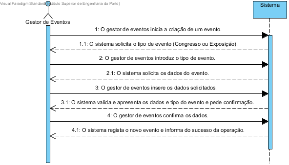

# UC1 Criar Evento
## Formato breve
O gestor de eventos inicia a criação de um evento.
O sistema solicita o tipo de evento (Congresso ou Exposição).
O gestor de eventos introduz o tipo de evento.
O sistema solicita os dados do evento.
O gestor insere os dados solicitados.
O sistema valida e apresenta os dados e tipo do evento e pede confirmação.
O gestor confirma os dados.
O sistema regista o novo evento e informa do sucesso da operação.

## SSD de Formato breve

## Formato completo

### Ator principal
* Gestor de eventos

### Partes interessadas e os seus interesses
+ Gestor de eventos: Pretende marcar um evento que será realizado no centro de eventos e encarregar organizadores de prepararem o espaço.
+ Centro de eventos: Pretende que seja marcado um evento que ser vai realizado no centro de eventos.
+ Organizadores: Pretendem que lhe sejam atribuido um evento para organizarem e prepararem o espaço.

### Pré-condições
+ Não existe um evento anteriormente marcado para o mesmo local no mesmo período de tempo.

### Pós-condições
* O evento fica marcado, no periodo de tempo e local estipulado, os organizadores ficam encarregues de preparar o evento.

### Cenário de sucesso principal (ou fluxo básico)
1. O gestor de eventos inicia o registo do evento.
2. O sistema solicita o tipo de evento(Congresso ou Exposição).
3. O gestor de eventos seleciona o tipo de evento.
4. O sistema solicita os dados do evento(titulo, descrição, data de inicio, data de fim, data limite de submissão de candidaturas, data limite de atribuições, data limite de avaliações e local de realização).
5. O gestor de eventos introduz os dados solicitados.
6. O sistema solicita um organizador para o evento.
7. O gestor de eventos insere um organizador.
8. O sistema valida o organizador e adiciona-o ao evento.
9. Os passos 6 a 8 repetem-se até que todos os organizadores tenham sido adicionados e no minimo tenham sido adicionados dois organizadores ao evento.
10. O sistema apresenta todos os dados e solicita confirmação do gestor.
11. O gestor confirma os dados.
12. O sistema regista o novo evento e informa o gestor do sucesso da operação.

### Extensões (ou fluxos alternativos)
\*a. O gestor solicita o cancelamento do registo.

+ O caso de uso termina.

5a. O sistema detecta dados minimos obrigatórios em falta.
1. O sistema informa quais são os dados em falta.
2. O sistema permite a introdução dos dados em falta(passo 4).

  2.a O gestor não altera os dados. O caso de termina.

5b. O sistema detecta que os dados(ou algum subconjunto destes) introduzidos devem ser únicos mas já existem no sistema.

1. O sistema avisa o gestor do facto.
2. O sistema permite a alteração dos dados(passo 4).
  2.a O gestor não altera os dados. O caso de uso termina.

5c. O sistema detecta que os dados(ou algum subconjunto destes) são inválidos.
1. O sistema avisa o gestor do facto.
2. O sistema permite a alteração dos dados(passo 4).
  2.a O utilizador não altera os dados. O caso de uso termina.

9a. O sistema deteta que o número de organizadores introduzidos é inferior a dois.
1. O sistema avisa o gestor do facto.
2. O sistema permite adicionar mais organizadores(passo 6).
  2.a O gestor de eventos não altera os dados. O caso de uso termina.  

11a. O gestor não confirma.
1. Nada é guardado permanentemente e os registos temporarios sao apagados.
## Requisitos especiais
*

## Lista de variações em tecnologias e dados
*

## Frequência de ocorrência
*

## Questões em aberto
+ Podem existir eventos com o mesmo nome desde que a data e/ou o local sejam diferentes?
+ Como é que o gestor pode cancelar um evento?
+ Como são informados os organizadores que vão estar encarregues deste evento ?
+ Quão frequente é a criação de eventos?
