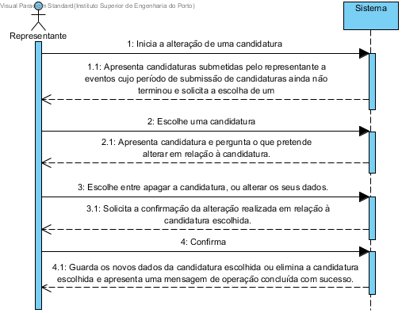

# UC10 - Alterar candidatura
## Formato breve
O representante do participante inicia no sistema a alteração de uma candidatura. O sistema apresenta as candidaturas submetidas pelo representante aos eventos cujo período de submissão de candidaturas ainda não terminou e solicita a escolha de uma. Após o representante definir a sua escolha, o sistema apresenta a candidatura escolhida e pergunta ao representante o que pretende alterar relativamente à candidatura. O representante escolhe entre apagar a candidatura ou alterar os dados da candidatura. O sistema solicita a confirmação da alteração realizada em relação à candidatura escolhida. O representante confirma. O sistema guarda os novos dados da candidatura escolhida ou elimina a candidatura escolhida e apresenta uma mensagem de operação concluída com sucesso.

## SSD de formato breve

## Formato completo
### Ator primário
+ Representante do participante

### Partes interessadas e seus interesses
+ __Representante do participante:__ Deseja poder alterar os dados da candidatura por ele submetida sem ter a necessidade de requisitar a eliminação da candidatura errada e a submissão de uma nova e deseja a opção de eliminar uma candidatura submetida a um evento, sem ter a necessidade de contactar um administrador de sistema para o efeito.

### Pré-condições
+ Utilizador registado em sistema como Representante de um participante.
+ O representante ter submetido no mínimo uma candidatura a um evento.
+ Deve ser possível alterar as candidaturas de um dado evento até à data limite de candidaturas.

### Pós-condições
+ Os dados de uma candidatura terem sido alterados ou uma candidatura ter sido eliminada do sistema.

### Cenário de sucesso principal (ou fluxo básico)
1. O representante do participante inicia no sistema a alteração de uma candidatura.
2. O sistema apresenta as candidaturas submetidas pelo representante aos eventos cujo período de submissão de candidaturas ainda não terminou e solicita a escolha de uma.
3. O representante seleciona uma das apresentadas.
4. O sistema apresenta a candidatura escolhida e pergunta ao representante se pretende alterar os dados da candidatura ou remover a candidatura.
5. O representante escolhe entre alterar os dados da candidatura, sendo-lhe requisitado pelo sistema que introduza os novos dados, sendo estes, por sua vez, posteriormente validados ou escolhe eliminar a candidatura indicada.
7. O sistema solicita a confirmação da alteração realizada.
8. O representante confirma.
9. O sistema guarda os novos dados da respetiva candidatura ou elimina a candidatura indicada do sistema e apresenta uma mensagem de sucesso.

### Extensões (ou fluxos alternativos)
\*a. O Gestor de Eventos solicita o cancelamento da alateração de uma candidatura.
> 1. O caso de uso termina.

## Requisitos especiais
* Deve ser possível alterar as candidaturas de um dado evento até à data limite de candidaturas.

## Lista de variações em tecnologias e dados
*

## Frequência de Ocorrência
*

## Questões em aberto
+
