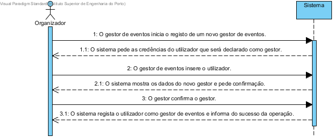

# UC11 Alterar Candidatura
##	Formato breve
O gestor de eventos inicia o registo de um novo gestor de eventos.
O sistema pede as credências do utilizador que será declarado como gestor.
O gestor de eventos insere o utilizador.
O sistema mostra os dados do novo gestor e pede confirmação.
O gestor confirma o gestor.
O sistema regista o utilizador como gestor de eventos e informa do sucesso da operação.

##	SSD de formato breve

##	Formato completo

### Ator principal
* Representante do Participante

### Partes interessadas e seus interesses
+ Centro de Eventos: Pretende que a candidatura efetuada seja alterada.
+ Participante: Pretende que a sua candidatura a um evento seja alterada.

### Pré-condições
+ A candidatura tem de estar previamente feita.

### Pós-condições
* O registo das alterações da candidatura a um evento fica armazenado no sistema.

### Cenário de sucesso principal (ou fluxo básico)
1. O gestor de eventos inicia o registo de um novo gestor de eventos.
2. O sistema pede as credências do utilizador que será declarado como gestor.
3. O gestor de eventos insere os dados do utilizador.
4. O sistema valida o utilizador e solicita confirmação do gestor.
5. O gestor confirma os dados.
6. O sistema regista o utilizador como gestor de eventos e informa o gestor do sucesso da operação.

### Extensões (ou fluxos alternativos)
\*a. O utilizador (não registado) solicita cancelamento do registo.

+ O caso de uso termina.

3a. Dados mínimos obrigatórios em falta.

1. O sistema informa quais os dados em falta.
2. O sistema permite a introdução dos dados em falta (passo 3)

    2.a O gestor de eventos não altera os dados. O caso de uso termina.

3b. O sistema detecta que os dados introduzidos (ou algum subconjunto dos dados) são inválidos.

1. O sistema alerta o gestor de eventos para o facto.
2. O sistema permite a sua alteração (passo 3)

    2a. O  gestor de eventos não altera os dados. O caso de uso termina.

## Requisitos especiais
*

## Lista de variações em tecnologias e dados
*

## Frequência de Ocorrência
*

## Questões em aberto
+ O registo de gestores de eventos deve estar sempre disponível?
+ É possivél o gestor anular a ação realizada?
+ O utilizador deve ser notificado do seu registo como gestor de eventos?
+ Qual a frequência de ocorrência deste caso de uso?
