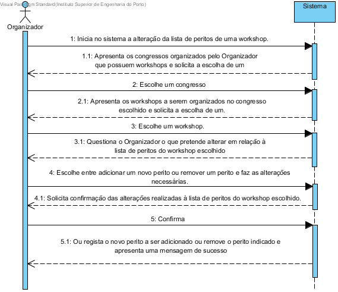

# UC11 Alterar Candidatura

##	Formato breve
O Representante inicia a edição da Candidatura.
O sistema mostra os eventos a que concorreu cuja a data de submissão ainda não tenha expirado.
O Representante seleciona o evento.
O sistema mostra a candidatura e solicita operação.
O Organizador seleciona a operação.
O sistema mostra os passos a serem efetuados.
O Organizador efetua os passos solicitados.
O sistema apresenta o resultado final e solicita confirmação.
O Organizador confirma.
O sistema regista as alterções efetuadas e indica sucesso.

##	SSD de formato breve

##	Formato completo

### Ator principal
* Representante do Participante

### Partes interessadas e seus interesses
+ Representante do Participante: Pretende alterar a sua candidatura.
+ Evento: Pretende manter atualizada as suas candidaturas.

### Pré-condições
+ Tem de ter uma candidatura registada no evento.
+ Não pode ter expirado o periodo de submissão de candidaturas desse evento.

### Pós-condições
* A candidatura fica alterada.

### Cenário de sucesso principal (ou fluxo básico)
1. O Representante inicia a edição da Candidatura.
2. O sistema mostra os eventos a que concorreu cuja a data de submissão ainda não tenha expirado.
3. O Representante seleciona o evento.
4. O sistema mostra a candidatura e solicita operação.
5. O Organizador seleciona a operação.
6. O sistema mostra os passos a serem efetuados.
7. O Organizador efetua os passos solicitados.
8. O sistema apresenta o resultado final e solicita confirmação.
9. O Organizador confirma.
10. O sistema regista as alterções efetuadas e indica sucesso.

### Extensões (ou fluxos alternativos)
\*a. O utilizador (não registado) solicita cancelamento do registo.

+ O caso de uso termina.

3a. Dados mínimos obrigatórios em falta.

1. O sistema informa quais os dados em falta.
2. O sistema permite a introdução dos dados em falta (passo 3)

    2.a O gestor de eventos não altera os dados. O caso de uso termina.

3b. O sistema detecta que os dados introduzidos (ou algum subconjunto dos dados) são inválidos.

1. O sistema alerta o gestor de eventos para o facto.
2. O sistema permite a sua alteração (passo 3)

    2a. O  gestor de eventos não altera os dados. O caso de uso termina.

    3a. Dados mínimos obrigatórios em falta.

    1. O sistema informa quais os dados em falta.
    2. O sistema permite a introdução dos dados em falta (passo 3)

        2.a O gestor de eventos não altera os dados. O caso de uso termina.

5a. Dados mínimos obrigatórios em falta.

1. O sistema informa quais os dados em falta.
2. O sistema permite a introdução dos dados em falta (passo 3)

    2.a O gestor de eventos não altera os dados. O caso de uso termina.

5b. O sistema detecta que os dados introduzidos (ou algum subconjunto dos dados) são inválidos.

1. O sistema alerta o gestor de eventos para o facto.
2. O sistema permite a sua alteração (passo 3)

    2a. O  gestor de eventos não altera os dados. O caso de uso termina.     

9a. O Organizador não confirma.

1. O caso de uso termina.

## Requisitos especiais
*

## Lista de variações em tecnologias e dados
*

## Frequência de Ocorrência
*

## Questões em aberto
+ Qual a frequência de ocorrência deste caso de uso?
