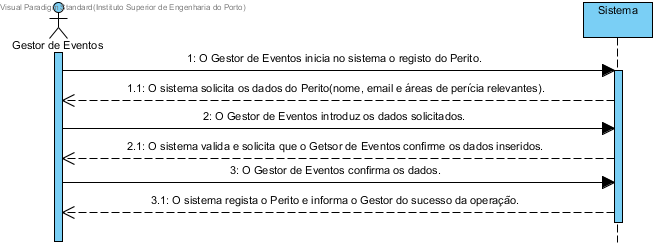

# UC12 Registar Perito

##	Formato breve
O Gestor de Eventos inicia no sistema o registo do Perito.
O sistema solicita os dados do Perito(nome, email e áreas de perícia relevantes).
O Gestor de Eventos introduz os dados solicitados.
O sistema valida e solicita que o Getsor de Eventos confirme os dados inseridos.
O Gestor de Eventos confirma os dados.
O sistema regista o Perito e informa o Gestor do sucesso da operação.

##	SSD de formato breve

##	Formato completo

### Ator principal
* Gestor de Eventos

### Partes interessadas e seus interesses
+ Perito: Pretende que as sua informações fiquem registadas para poder ser atribuido a um workshop.
+ Gestor de Eventos: Pretende criar e manter registo dos Peritos para posteriormente serem atribuidos a workshops.

### Pré-condições
+ Perito não se encontra já registado no sistema.

### Pós-condições
* O Perito fica armazenado no sistema.

### Cenário de sucesso principal (ou fluxo básico)
1. O Gestor de Eventos inicia no sistema o registo do Perito.
2. O sistema solicita os dados do Perito(nome, email e áreas de perícia relevantes).
3. O Gestor de Eventos introduz os dados solicitados.
4. O sistema valida e solicita que o Getsor de Eventos confirme os dados inseridos.
5. O Gestor de Eventos confirma os dados.
6. O sistema regista o Perito e informa o Gestor do sucesso da operação.

### Extensões (ou fluxos alternativos)
\*a. O utilizador (não registado) solicita cancelamento do registo.

+ O caso de uso termina.

4a. Dados mínimos obrigatórios em falta.

1. O sistema informa quais os dados em falta.
2. O sistema permite a introdução dos dados em falta (passo 3)

    2.a O utilizador (não registado) não altera os dados. O caso de uso termina.

4b. O sistema detecta que os dados (ou algum subconjunto dos dados) introduzidos devem ser únicos e que já existem no sistema.

1. O sistema alerta o utilizador para o facto.
2. O sistema permite a sua alteração (passo 3)

    2a. O utilizador (não registado) não altera os dados. O caso de uso termina.

4c. O sistema detecta que os dados introduzidos (ou algum subconjunto dos dados) são inválidos.

1. O sistema alerta o utilizador para o facto.
2. O sistema permite a sua alteração (passo 3)

    2a. O utilizador (não registado) não altera os dados. O caso de uso termina.

## Requisitos especiais
*

## Lista de variações em tecnologias e dados
*

## Frequência de Ocorrência
*

## Questões em aberto
+ Qual a frequência de ocorrência deste caso de uso?
+ Que tipo de encriptação deverá ser implementada?
