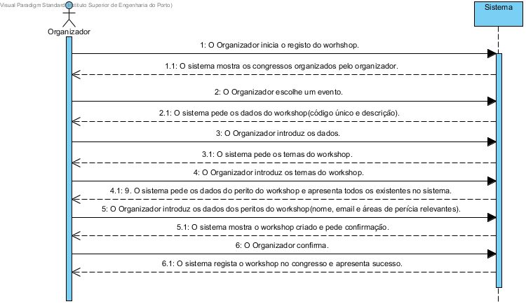

# UC9 Criar Workshop
## Formato breve
O Organizador inicia o registo do workshop.
O sistema mostra os congressos organizados pelo organizador.
O Organizador escolhe um evento.
O sistema pede os dados do workshop (código único, descrição e temas).
O Organizador introduz os dados.
O sistema apresenta uma lista de peritos recomendados que podem ser adicionados na totalidade ao workshop a ser criado.
O sistema disponibiliza a opção de adicionar um novo perito diferente dos recomendados.
O Organizador introduz os dados dos peritos do workshop (nome, email e áreas de perícia relevantes).
O sistema pede confirmação dos Peritos a serem adicionados ao Workshop.
O organizador confirma.
O sistema valida os peritos e regista-os no respetivo Workshop.
O sistema mostra o workshop criado e pede confirmação.
O Organizador confirma.
O sistema regista o workshop no congresso e apresenta sucesso.

## SSD de formato breve

## Formato completo

### Ator principal
* Organizador

### Partes interessadas e seus interesses
+ Organizador: Pretende criar um Workshop para que seja registado no congresso.
+ Centro de Eventos: Pretende que fique registado o Workshop do congresso.

### Pré-condições
+ O Workshop em questão não pode estar já registado.
+ O evento(congresso) para o qual será criado o Workshop tem de estar criado na aplicação.

### Pós-condições
* O registo do Workshop fica armazenado no sistema.

### Cenário de sucesso principal (ou fluxo básico)
1. O Organizador inicia o registo do workshop.
2. O sistema mostra os congressos organizados pelo organizador.
3. O Organizador escolhe um dos congressos.
4. O sistema pede os dados do workshop (código único, descrição e temas).
5. O Organizador introduz os dados.
6. O sistema apresenta um conjunto de Peritos recomendados para o workshop a ser criado, através de um algoritmo.
7. O organizador escolhe adicionar (todos) os peritos recomendados ao Workshop a ser criado ou escolhe ignorar este passo.
8. O sistema solicita os dados de um perito a ser adicionado ao workshop.
9. O Organizador introduz os dados do perito (nome, email e áreas de perícia relevantes).
10. Os passos 8 a 9 repetem-se até todos os peritos terem sido introduzidos.
11. O sistema solicita a confirmação dos peritos a serem adicionados.
12. O organizador confirma.
13. O sistema valida e regista os Peritos criados/escolhidos ao workshop criado e solicita a confirmação do workshop criado.
14. O Organizador confirma.
15. O sistema valida e regista o workshop no congresso e apresenta mensagem de sucesso.

### Extensões (ou fluxos alternativos)
\*a. O representante do participante (com a candidatura não registada) solicita cancelamento do registo.

+ O caso de uso termina.

5a. Dados mínimos obrigatórios em falta.

1. O sistema informa quais os dados em falta.
2. O sistema permite a introdução dos dados em falta (passo 4).

    2.a O Organizador não altera os dados. O caso de uso termina.

5b. O sistema detecta que os dados (ou algum subconjunto dos dados) introduzidos devem ser únicos(código único) e que já existem no sistema.

1. O sistema alerta o Organizador para o facto.
2. O sistema permite a sua alteração (passo 4).

    2a. O Organizador não altera os dados. O caso de uso termina.

5c. O sistema detecta que os dados introduzidos (ou algum subconjunto dos dados) são inválidos.

1. O sistema alerta o Organizador para o facto.
2. O sistema permite a sua alteração (passo 4).

    2a. O Organizador não altera os dados. O caso de uso termina.

7a. Dados mínimos obrigatórios em falta.

1. O sistema informa quais os dados em falta.
2. O sistema permite a introdução dos dados em falta (passo 6).

    2.a O Organizador não altera os dados. O caso de uso termina.

7b. O sistema detecta que os dados (ou algum subconjunto dos dados) introduzidos devem ser únicos e que já existem no sistema.

1. O sistema alerta o Organizador para o facto.
2. O sistema permite a sua alteração (passo 6).

    2a. O Organizador não altera os dados. O caso de uso termina.

7c. O sistema detecta que os dados introduzidos (ou algum subconjunto dos dados) são inválidos.

1. O sistema alerta o Organizador para o facto.
2. O sistema permite a sua alteração (passo 6).

    2a. O Organizador não altera os dados. O caso de uso termina.    

10a. Dados mínimos obrigatórios em falta.

1. O sistema informa quais os dados em falta.
2. O sistema permite a introdução dos dados em falta (passo 9)

    2.a O Organizador não altera os dados. O caso de uso termina.

10b. O sistema detecta que os dados (ou algum subconjunto dos dados) introduzidos devem ser únicos(email) e que já existem no sistema.

1. O sistema alerta o Organizador para o facto.
2. O sistema permite a sua alteração (passo 9).

    2a. O Organizador não altera os dados. O caso de uso termina.

10c. O sistema detecta que os dados introduzidos (ou algum subconjunto dos dados) são inválidos.

1. O sistema alerta o Organizador para o facto.
2. O sistema permite a sua alteração (passo 9)

    2a. O Organizador não altera os dados. O caso de uso termina.  

13a. O Organizador não confirma.
1. Nada é guardado permanentemente e os registos temporarios sao apagados.

## Requisitos especiais
*

## Listas de variações em tecnologias e dados
*

## Frequência de Ocorrência
*

## Questões em aberto
+ Como é que o Organizador poderá anular posteriormente o Workshop?
+ Qual a frequência de ocorrência deste caso de uso?
